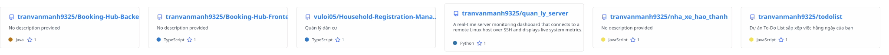
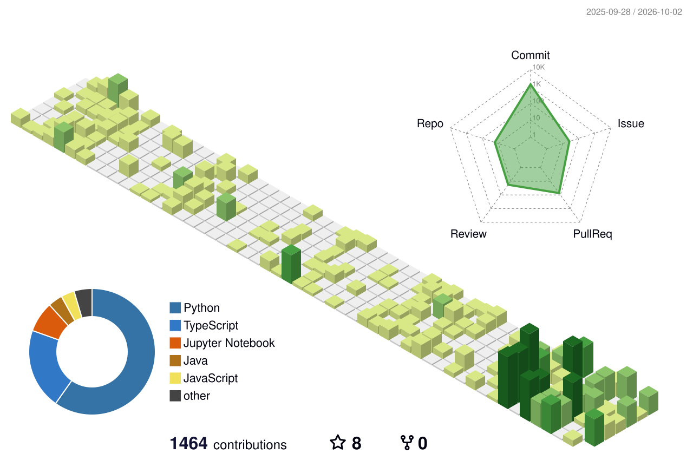

# Tran Van Manh | Staff-Track Distributed Systems Engineer

  

 

<table>
  <tr>
    <td width="58%" valign="top">
      <h3>Staff Engineering Profile</h3>
      

        <strong>Senior / Staff-Track Backend &amp; Distributed Systems Engineer</strong> graduated from <strong>Hanoi University of Science and Technology (HUST)</strong>. Specialized in architecting low-latency enterprise backends, resilient microservices, and distributed data infrastructures.
      

      <ul>
        <li><strong>High-Throughput Core</strong>: Java 21, Spring Boot 3, Virtual Threads, Reactive Streams</li>
        <li><strong>Distributed Resilience</strong>: Redis Cluster, Cache-Aside, Bucket4j Throttling, Circuit Breakers</li>
        <li><strong>Full Observability</strong>: OpenTelemetry, Prometheus, Grafana, Distributed Tracing</li>
        <li><strong>Modern Fullstack &amp; DevOps</strong>: TypeScript, Next.js, Docker Compose, Linux Internals, CI/CD</li>
      </ul>
      

        
        
        
      

    </td>
    <td width="42%" valign="middle" align="center">
      <picture>
        <source media="(prefers-color-scheme: dark)" srcset="https://github-stats-extended.vercel.app/api?username=tranvanmanh9325&theme=tokyonight&show_icons=true&hide_border=true" />
        <source media="(prefers-color-scheme: light)" srcset="https://github-stats-extended.vercel.app/api?username=tranvanmanh9325&theme=default&show_icons=true&hide_border=true" />
        
      </picture>
       
      <picture>
        <source media="(prefers-color-scheme: dark)" srcset="https://streak-stats.demolab.com/?user=tranvanmanh9325&theme=tokyonight&hide_border=true" />
        <source media="(prefers-color-scheme: light)" srcset="https://streak-stats.demolab.com/?user=tranvanmanh9325&theme=clean&hide_border=true" />
        
      </picture>
    </td>
  </tr>
</table>

---

## GitHub Achievements

  <picture>
    <source media="(prefers-color-scheme: dark)" srcset="https://github-trophies.vercel.app/?username=tranvanmanh9325&theme=onedark&no-frame=false&no-bg=false&margin-w=4" />
    <source media="(prefers-color-scheme: light)" srcset="https://github-trophies.vercel.app/?username=tranvanmanh9325&theme=flat&no-frame=false&no-bg=false&margin-w=4" />
    
  </picture>

---

## Technology Stack & Core Competencies

  

 

  <picture>
    <source media="(prefers-color-scheme: dark)" srcset="./assets/tech-stack-marquee-dark.svg" />
    <source media="(prefers-color-scheme: light)" srcset="./assets/tech-stack-marquee-light.svg" />
    
  </picture>

 

### Core Backend & Distributed Systems

  <picture>
    <source media="(prefers-color-scheme: dark)" srcset="./assets/marquee-backend-dark.svg" />
    <source media="(prefers-color-scheme: light)" srcset="./assets/marquee-backend-light.svg" />
    
  </picture>

### Frontend & Modern Web Architecture

  <picture>
    <source media="(prefers-color-scheme: dark)" srcset="./assets/marquee-frontend-dark.svg" />
    <source media="(prefers-color-scheme: light)" srcset="./assets/marquee-frontend-light.svg" />
    
  </picture>

### Cloud Infrastructure, DevOps & Systems

  <picture>
    <source media="(prefers-color-scheme: dark)" srcset="./assets/marquee-devops-dark.svg" />
    <source media="(prefers-color-scheme: light)" srcset="./assets/marquee-devops-light.svg" />
    
  </picture>

### Observability, Tooling & Architecture

  <picture>
    <source media="(prefers-color-scheme: dark)" srcset="./assets/marquee-observability-dark.svg" />
    <source media="(prefers-color-scheme: light)" srcset="./assets/marquee-observability-light.svg" />
    
  </picture>

---

## System Architecture Matrix

  

 

| Architecture Domain | Core Stack | Key Patterns | Core Implementation | SLA & Impact |
| :--- | :--- | :--- | :--- | :--- |
| **Concurrency Models & Virtual Threads** | `Java 21 LTS` `Project Loom` `StructuredTaskScope` | Thread-per-Request Structured Concurrency Work-Stealing | • User-mode Virtual Threads unmount on blocking I/O; ReentrantLock avoids carrier pinning. • StructuredTaskScope orchestrates fail-fast concurrency without thread leaks. | • **`50,000+ req/s`** sustained throughput on 4 vCPU / 8 GB. • **`RAM 1MB → ~1KB`** per thread (>95% memory savings). • **`Sub-10ms P99`** latency with zero thread starvation. |
| **Distributed Caching & High Throughput** | `Redis 7 Cluster` `Redisson / Caffeine` `Bucket4j` | Multi-Tier Cache (L1/L2) Distributed Mutex Token Bucket Limiting | • Cache-Aside with jittered TTL and Redisson mutex locks to eliminate Cache Stampede. • Caffeine L1 + Redis L2 sync via Pub/Sub; Bucket4j edge rate limiting (HTTP 429). | • **`Sub-2ms Latency`** (L2) and **`< 0.15ms`** (L1) read speed. • **`> 85% DB Offload`** ratio under high concurrent load. • **`10,000+ req/s`** burst throttling with zero degradation. |
| **Observability & Distributed Tracing** | `OpenTelemetry SDK` `Prometheus / Grafana` `Micrometer` | RED & USE Metrics W3C Context Propagation Log-to-Metric Correlation | • Injected W3C traceparent across gateway and services mapped to Logback MDC. • 1-click Grafana drill-down from spikes to traces; Micrometer pool telemetry. | • **`MTTR < 5 min`** (reduced from multi-hour incident triage). • **`< 2.5% CPU`** telemetry instrumentation overhead. • **`P99 > 250ms`** & error > 1% instant latency alerts. |
| **Resilient Microservices & Fault Tolerance** | `Spring Cloud Gateway` `Netflix Eureka` `Resilience4j` | Circuit Breaker Pattern Bulkhead Partitioning Reactive Ingress Routing | • Non-blocking Netty routing in Spring Cloud Gateway with Eureka load balancing. • Resilience4j circuit breakers (50% threshold) and semaphore bulkheads for fault isolation. | • **`99.95% HA`** maintained under chaos fault injection. • **`100% Checkout Uptime`** via graceful fallbacks. • **`Zero Cascading Outages`** across downstream tiers. |

---

## Featured Engineering Projects

  <picture>
    <source media="(prefers-color-scheme: dark)" srcset="./assets/projects-marquee-dark.svg" />
    <source media="(prefers-color-scheme: light)" srcset="./assets/projects-marquee-light.svg" />
    
  </picture>

---

## GitHub Analytics & Performance

  

 

<!-- 3D contribution graph auto-generated by GitHub Actions. Run workflow from Actions tab to generate. -->

  <picture>
    <source media="(prefers-color-scheme: dark)" srcset="./profile-3d-contrib/profile-night-rainbow.svg" />
    <source media="(prefers-color-scheme: light)" srcset="./profile-3d-contrib/profile-green-animate.svg" />
    
  </picture>

 

  <picture>
    <source media="(prefers-color-scheme: dark)" srcset="https://github-activity-graph.vercel.app/graph?username=tranvanmanh9325&amp;theme=tokyo-night&amp;custom_title=Contribution+Activity+Graph" />
    <source media="(prefers-color-scheme: light)" srcset="https://github-activity-graph.vercel.app/graph?username=tranvanmanh9325&amp;theme=github-light&amp;custom_title=Contribution+Activity+Graph" />
    
  </picture>

 

  <picture>
    <source media="(prefers-color-scheme: dark)" srcset="https://github-stats-extended.vercel.app/api/top-langs/?username=tranvanmanh9325&amp;layout=compact&amp;langs_count=8&amp;theme=tokyonight&amp;hide_border=true" />
    <source media="(prefers-color-scheme: light)" srcset="https://github-stats-extended.vercel.app/api/top-langs/?username=tranvanmanh9325&amp;layout=compact&amp;langs_count=8&amp;theme=default&amp;hide_border=true" />
    
  </picture>

 

  <picture>
    <source media="(prefers-color-scheme: dark)" srcset="https://raw.githubusercontent.com/tranvanmanh9325/tranvanmanh9325/output/github-contribution-grid-snake-dark.svg" />
    <source media="(prefers-color-scheme: light)" srcset="https://raw.githubusercontent.com/tranvanmanh9325/tranvanmanh9325/output/github-contribution-grid-snake.svg" />
    
  </picture>

---

## Current Focus & Technical Roadmap

- **Event-Driven Architecture**: Deepening mastery of **Apache Kafka** for asynchronous, high-throughput distributed event streaming and message queuing.
- **Distributed Observability**: Implementing end-to-end distributed tracing using **OpenTelemetry**, metrics monitoring with **Prometheus**, and dashboards with **Grafana**.
- **Cloud Native Orchestration**: Scaling containerized microservices with **Kubernetes (K8s)**, Helm charts, and automated deployment pipelines.
- **Open Source & High-Scale Systems**: Actively designing and contributing to developer tooling, concurrency patterns, and scalable backend architectures.

---

## Connect With Me

  
  
  
  
  
  
  

---

  
<em>"Quality is not an act, it is a habit. Code with passion, build with precision."</em>

  
<strong>Thanks for visiting! Open to impactful backend &amp; distributed systems challenges.</strong>

